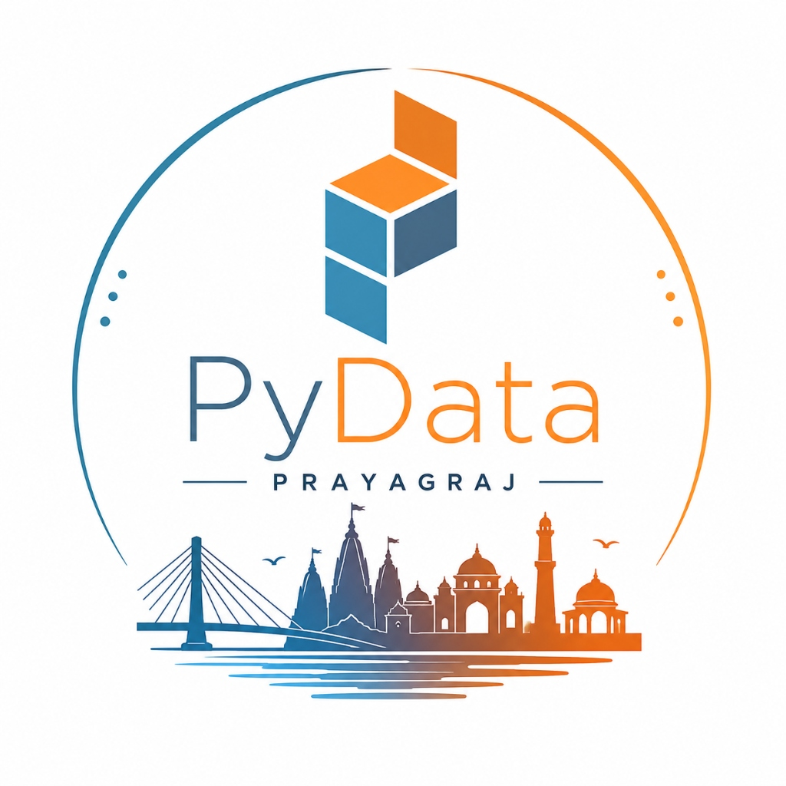

<div align="center">

  <!-- Animated Header Banner -->
  

  # ⚡ PyData Prayagraj Web Platform

  **Community for all developers, researchers, and data builders in Prayagraj.**

  [](https://react.dev/)
  [](https://vitejs.dev/)
  [](https://tailwindcss.com/)
  [](https://www.framer.com/motion/)
  [](LICENSE)

  <br />

  <a href="https://chat.whatsapp.com/EIaEqgTDw5d3zGT04Jsw1E" target="_blank">
    
  </a>
  <a href="https://pydata.org" target="_blank">
    
  </a>

</div>

<hr />

## 🎯 GitHub Repository Overview

> **GitHub Short Description (Copy & Paste):**  
> `Official web platform for PyData Prayagraj — an open community for Python developers, data scientists, researchers, and builders in Prayagraj. Built with React 18, Vite, Tailwind CSS v4, and Framer Motion.`

---

## ✨ Features & Highlights

- 🏙️ **Full-Screen Hero Slideshow**: Seamless crossfade backdrop featuring iconic Prayagraj landmarks (*University of Allahabad*, *Triveni Sangam*, *New Naini Bridge*, *Mandapam*, *High Court*).
- 💧 **Transparent-to-Glass Navbar**: Scroll-triggered header that transitions from transparent to a translucent glassmorphic navigation bar with the official PyData Prayagraj logo.
- 🖤 **Pro Monochrome Black & White Aesthetic**: Ultra-sleek, minimalist high-contrast typography and design system built for maximum legibility and professional appeal.
- 🎯 **Big "About PyData" Showcase**: Left-hand side circular emblem logo animation combined with rich details on **NumFOCUS** and global PyData initiatives.
- 📺 **Horizontal PyData Video Showcase**: Scrollable carousel of curated PyData technical talks with duration tags and direct video links.
- 🎬 **Scroll Animations**: Smooth entrance transitions and micro-interactions powered by `framer-motion`.
- 📱 **100% Fluid Responsive Layout**: Tested across all viewports (Mobile `320px+`, Tablet, Laptop, Desktop) with touch-friendly navigation drawer.

---

## 📁 Repository Structure

```gfm
pydata-prayagraj-react/
├── public/
│   ├── email-sign.png          # Official PyData Prayagraj logo image
│   ├── pydata-logo-circle.png  # Circular PyData emblem logo mark
│   └── glance/                 # Prayagraj landmark photos archive
├── src/
│   ├── components/
│   │   ├── Navbar.jsx          # Translucent scroll-triggered navigation header
│   │   ├── HeroSlideshow.jsx   # Full viewport background image crossfade slider
│   │   ├── VideoCarousel.jsx   # Horizontal scrolling PyData video showcase
│   │   ├── Footer.jsx          # Full-width multi-column footer with WhatsApp CTA
│   │   └── ScrollToTop.jsx     # Route change scroll restoration utility
│   ├── pages/
│   │   ├── HomePage.jsx        # Landing page (Hero, Why PyData, About, Events)
│   │   ├── AlbumsPage.jsx      # Filterable photo archive
│   │   ├── JournalPage.jsx     # Blog & editorial notes queue
│   │   ├── TeamPage.jsx        # Organizers, Core Team, Volunteers, & Ambassadors roster
│   │   ├── EventsPage.jsx      # Chapter event calendar & announcements
│   │   ├── SponsorPage.jsx     # Partnership pillars & inquiry card
│   │   ├── FaqPage.jsx         # Accordion FAQ guide
│   │   └── PrivacyPage.jsx     # Code of Conduct & Privacy Policy
│   ├── App.jsx                 # React Router setup & global page layout
│   ├── main.jsx                # Application root mounting
│   └── index.css               # Design system & Tailwind CSS imports
├── package.json
└── vite.config.js
```

---

## 🚀 Quick Start Guide

### Prerequisites
- [Node.js](https://nodejs.org/) (v18.0 or higher)
- [npm](https://www.npmjs.com/) or `pnpm`

### Installation Steps

1. **Clone the repository:**
   ```bash
   git clone https://github.com/PyData-Prayagraj/pydata-prayagraj-react.git
   cd pydata-prayagraj-react
   ```

2. **Install dependencies:**
   ```bash
   npm install
   ```

3. **Start the local development server:**
   ```bash
   npm run dev
   ```
   Open `http://localhost:5173/` in your browser to view the application.

4. **Build for production:**
   ```bash
   npm run build
   ```
   The compiled production output will be generated inside the `dist/` directory.

---

## 👥 Chapter Organizers

| Name | Role | Socials |
| :--- | :--- | :--- |
| **Priyankar Shukla** | Lead Organizer | [GitHub](https://github.com/) · [LinkedIn](https://linkedin.com/) |
| **Animesh Pathak** | Co-Organizer | [GitHub](https://github.com/) · [LinkedIn](https://linkedin.com/) |
| **Aryan Dubey** | Co-Organizer | [GitHub](https://github.com/) · [LinkedIn](https://linkedin.com/) |
| **Shivansh Dubey** | Co-Organizer | [GitHub](https://github.com/) · [LinkedIn](https://linkedin.com/) |
| **Suryansh Tripathi** | Co-Organizer | [GitHub](https://github.com/) · [LinkedIn](https://linkedin.com/) |

---

## 🤝 Community & Governance

PyData is an educational program of **[NumFOCUS](https://numfocus.org)**, a 501(c)(3) non-profit charity in the United States. PyData Prayagraj is dedicated to providing a respectful, harassment-free environment for everyone under our **[Code of Conduct](src/pages/PrivacyPage.jsx)**.

- 💬 **Join Chapter WhatsApp**: [Chat Link](https://chat.whatsapp.com/EIaEqgTDw5d3zGT04Jsw1E)
- 🤝 **Be a Volunteer**: [Google Form](https://docs.google.com/forms/d/1DCHkBbmeQlBa0kZMwxC8-x2mj9-QaeDEkdduYqVJLDI/edit?usp=forms_home&ouid=113293290420530468365&ths=true&pli=1)
- 🎓 **Join as Ambassador**: [Form Link](https://forms.gle/DzxfTmGYXoZQLcrm6)

---

<div align="center">
  <sub>Made with ❤️ by PyData Prayagraj Community · © 2026 PyData Prayagraj</sub>
</div>
